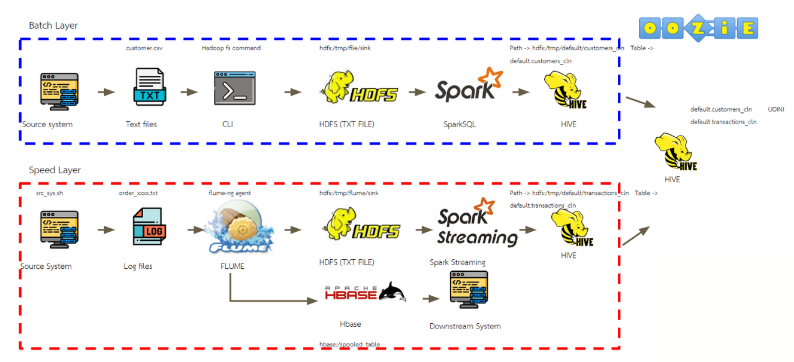
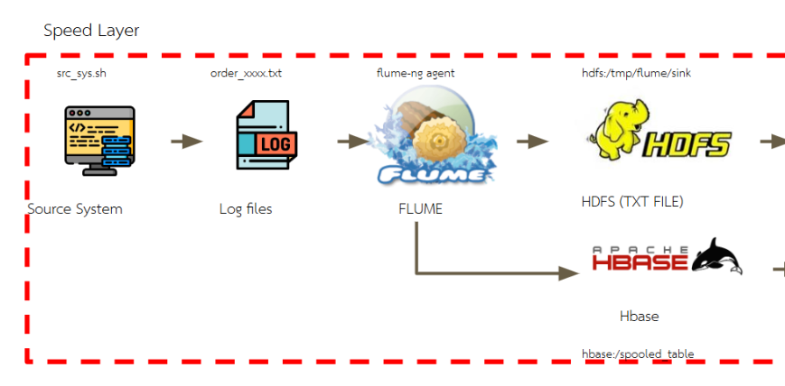

# Manage data with Hadoop system

**Description** :

A newly opened coffee shop wants to create an data system with hadoop that calculates daily membership points. To carry out various campaigns and promotions. And want to send real-time data when customers place an order to send it to the back end system for quickly check the latest orders.

**System Design**




**Getting Started**
1. Set up
* Set-up google compute engine
* Set-up Firewall Network

* Install docker on VM and pull image "mikelemikelo/cloudera-spark:latest"
* Run container by command "docker run --hostname=quickstart.cloudera --privileged=true -it -p 8888:8888 -p8080:8080 -p 7180:7180 -p 88:88/udp -p 88:88 mikelemikelo/cloudera-spark:latest/usr/bin/docker-quickstart-light"
* Start cloudera manager then login to cloudera manager to port 7180 username&password: cloudera
* Before start cluster, go through hive service and set configuration to none.

* Delete unnecessary service and add flume to service
* Start cluster, wait until all services run
* Login to cloudera hue to port 8888 username&password: cloudera
* Clone and copy file from this repo to running container
* Use "docker exec" to go back in existing container

2. Go through batch layer by import customer.csv to HDFS

  
* Create folder hdfs:/tmp/file/sink

* Put file into above path


3. Go through speed layer


* Create source paths to connect with Flume

* Create sink paths to connect with Flume
    * For HDFS


    * For Hbase
    
    

* Upload flume configuration file "flume_hbase.conf", "flume_hdfs.conf"

* Already finish this stage

* Next step, generate data "src_sys.sh" to flume

* Data completely sink to HDFS and Hbase


* Query data by using Hive editor service
    * Create table "customers"
    ```
    CREATE TABLE customers(
	  customer_id int, 
	  home_store int, 
	  customer_firstname string, 
	  customer_email string, 
	  customer_since string, 
	  loyalty_card_number string, 
	  birthdate string, 
	  gender string, 
	  birth_year int)
	ROW FORMAT DELIMITED 
	  FIELDS TERMINATED BY ',' 
	  LINES TERMINATED BY '\n' 
	STORED AS INPUTFORMAT 
	  'org.apache.hadoop.mapred.TextInputFormat' 
	OUTPUTFORMAT 
	  'org.apache.hadoop.hive.ql.io.HiveIgnoreKeyTextOutputFormat'
	LOCATION
	  '/tmp/file/sink/'
    ```
    
    * Create table "transactions"
    ```
    CREATE TABLE default.transactions(
   customer_id         int
  ,customer_order  	string
  ,order_timestamp	bigint) 
  ROW FORMAT DELIMITED 
  FIELDS TERMINATED BY '|' 
  LINES TERMINATED BY '\n'
  STORED AS INPUTFORMAT 
  'org.apache.hadoop.mapred.TextInputFormat' 
  OUTPUTFORMAT 
  'org.apache.hadoop.hive.ql.io.HiveIgnoreKeyTextOutputFormat'
  LOCATION
  '/tmp/flume/sink/'
    ```
  


4. Clean data "customers" and "transactions" with spark before store to Hive


* At batch layer, submit spark.py


* At speed layer, submit spark_streaming.py


5. Generate data for membership and points analyic 
* Create loyalty table


6. Last step, use oozie to schedule job for generate loyalty table


Thank you references data from https://school.datath.com/